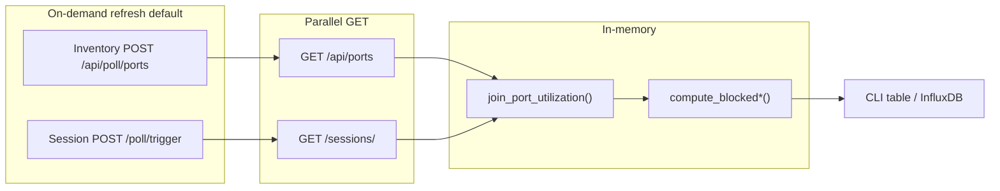

# IxPort Utilization Plotter

**New here?** See **[QUICKSTART.md](QUICKSTART.md)** for clone → configure → CLI → HTML dashboard in a few steps.

Identifies **blocked** Ixia chassis ports: owned and reserved but not carrying traffic. The tool polls two Explorer APIs, joins inventory with IxNetwork session data in memory, applies blocked-detection rules, and prints a report (or writes time-series snapshots to InfluxDB).

## Prerequisites

- Python 3.11+
- Reachable **Ixia Inventory Explorer** and **IxNetwork Session Explorer** instances
- Optional: Docker for InfluxDB (`docker-compose.yml`) if you use the metrics poller

```bash
python3 -m venv .venv
source .venv/bin/activate
pip install -r requirements.txt
cp .env.example .env   # edit URLs and tokens
```

## Configuration

Set in `.env` (see `.env.example`):

| Variable | Purpose |
|----------|---------|
| `INVENTORY_EXPLORER_URL` | Inventory Explorer base URL |
| `SESSION_EXPLORER_URL` | Session Explorer base URL |
| `REFRESH_SETTLE_SECONDS` | Wait after poll triggers before GET (default `3`) |
| `INVENTORY_POLL_TIMEOUT` / `SESSION_POLL_TIMEOUT` | Max seconds for POST poll triggers |
| `INFLUXDB_*` | Used only by `scripts/poll_port_metrics.py` |

## Commands: finding blocked ports

Primary CLI:

```bash
.venv/bin/python scripts/sync_true_port_utilization.py
```

By default each run **refreshes both explorers** (chassis + IxNetwork poll), waits `REFRESH_SETTLE_SECONDS`, then GETs data and joins.

### Blocked-only view

```bash
# Main table + owner report: only blocked=True
.venv/bin/python scripts/sync_true_port_utilization.py --blocked-only
```

### All owned ports (triage)

```bash
# Owner report section: every owned port (blocked, in-use, unknown)
.venv/bin/python scripts/sync_true_port_utilization.py --all
```

### Other useful flags

```bash
# One chassis
.venv/bin/python scripts/sync_true_port_utilization.py --chassis 10.36.236.121 --blocked-only

# Skip on-demand poll (fast, may be stale)
.venv/bin/python scripts/sync_true_port_utilization.py --no-refresh

# Session Explorer filters
.venv/bin/python scripts/sync_true_port_utilization.py --server ixnetworkweb --tag lab
```

### Output sections

1. **Main table** — every joined inventory port (unless `--blocked-only`).
2. **Blocked ports (owner)** — ports with `blocked=True` (default footer), or **All owned ports** with `--all`.

Columns: `chassis | port | owner | session | transmitState | cp | dp | utilization | blocked`.

### HTML port watch dashboard

Lightweight browser dashboard — same data as `--blocked` and `--all`, auto-refreshes every 5 minutes:

```bash
.venv/bin/python scripts/port_watch_dashboard.py
# open http://<this-host>:8765  (listens on 0.0.0.0 by default)
```

Use `--no-refresh` for faster snapshots (cached Explorer data). Use `--host 127.0.0.1` to restrict to localhost only.

### Continuous metrics (optional)

```bash
.venv/bin/python scripts/poll_port_metrics.py --once      # poll + write InfluxDB
.venv/bin/python scripts/poll_port_metrics.py             # every 5 minutes
.venv/bin/python scripts/poll_port_metrics.py --dry-run   # no Influx write
```

Optional: run `docker compose up -d` for InfluxDB, then `poll_port_metrics.py` to store time-series snapshots. See `docs/metrics.md` for field definitions and Flux query examples.

### Debug: raw session ports only

```bash
.venv/bin/python scripts/list_session_ports.py
```

---

## Blocked / not blocked rules

End-user rubric with every calculated column: **[docs/blocked_port_rubric.md](docs/blocked_port_rubric.md)**.

Evaluation applies only to **owned** ports (`owner` non-empty and not `Free`, case-insensitive).

Every CLI row lists **`transmitState`**, **`cp`**, **`dp`**, and **`utilization`** together. Session fields come from IxNetwork Session Explorer; if the port is **not** in any session, `cp` / `dp` / `utilization` are **N/A**. **`blocked`** is derived from `owner` + `transmitState` + `cp` (DP and utilization are shown for context but do not change `blocked`).

### Port in an IxNetwork session

| transmitState | CP | DP | Utilization | blocked | Meaning |
|---------------|-----|-----|-------------|---------|---------|
| `0` | `False` | (shown) | (shown) | **True** | Reserved, no control-plane traffic (blocked) |
| `0` | `True` | (shown) | (shown) | **False** | Control plane active |
| `1` | (shown) | (shown) | (shown) | **False** | Chassis transmit active — not blocked |

Implemented in `collector/port_blocked.py` → `compute_blocked()`.

### Port owned on chassis but **not** in any session

| transmitState | CP | DP | Utilization | blocked | Meaning |
|---------------|-----|-----|-------------|---------|---------|
| `1` | N/A | N/A | N/A | **False** | Chassis shows transmit active (e.g. Windows/RDP clients) — not blocked |
| `0` | N/A | N/A | N/A | **N/A** | Cannot conclude without session CP data |
| other | N/A | N/A | N/A | **N/A** | Unknown |

Implemented in `compute_blocked_without_session()`.

### Unowned / Free ports

| transmitState | CP | DP | Utilization | blocked |
|---------------|-----|-----|-------------|---------|
| (shown) | **N/A** | **N/A** | **N/A** | **N/A** |

Not evaluated as blocked hogging.

### Display vs Influx

| Display | Influx field value |
|---------|-------------------|
| `True` / `False` | `1` / `0` |
| `N/A` | `-1` |

---

## How the two APIs are polled and joined



1. **Inventory Explorer** — physical port list per chassis: `owner`, `transmitState` (normalized to `0` / `1`).
2. **Session Explorer** — ports assigned to IxNetwork sessions: `cp_active`, `dp_active`, `utilized`, plus server/session name.
3. **Join key** — `(chassis_ip, port)` with normalized labels (`collector/join_keys.py`).
4. **LEFT JOIN** — every inventory port is kept; session metrics attach when a matching session port exists.
5. **Blocked** — rules above on the merged row.

The Python collector does **not** call chassis REST directly; Explorer services perform chassis/IxNetwork polling.

---

## Code walkthrough

### 1. CLI entry — `scripts/sync_true_port_utilization.py`

Parses flags (`--blocked-only`, `--all`, `--no-refresh`, …), calls `fetch_true_port_utilization_sync()`, prints `format_true_util_table()` and `format_owner_ports_report()`.

### 2. Orchestration — `collector/true_port_utilization.py`

`fetch_true_port_utilization_async()`:

- `refresh_explorers_async()` — optional parallel POST triggers + settle sleep
- `fetch_port_records()` (inventory) and `fetch_session_port_records()` (sessions) in parallel
- `join_port_utilization()` — merge lists into `TruePortUtilRecord`

Join logic (simplified):

```python
sess = session_by_key.get(inventory_join_key(inv))
if sess:
    cp, dp, utilization = sess.cp, sess.dp, sess.utilization
    blocked = compute_blocked(owner=..., transmit_state=..., cp=cp)
else:
    cp = dp = utilization = None
    blocked = compute_blocked_without_session(owner=..., transmit_state=...)
```

### 3. Inventory client — `collector/ports_client.py`

- `trigger_ports_poll()` → `POST /api/poll/ports`
- `fetch_port_records()` → `GET /api/ports` → `PortRecord` (`chassis_ip`, `port`, `owner`, `transmit_state`)

### 4. Session client — `collector/session_ports_client.py`

- `trigger_session_poll()` → `POST /poll/trigger`
- `fetch_session_port_records()` → `GET /sessions/` → `SessionPortRecord` (includes `ixnet_server`, `session_name`, CP/DP/util flags)

### 5. Blocked rules — `collector/port_blocked.py`

- `is_port_owned()` — skips `Free`/empty owners
- `compute_blocked()` — session-present cases 1–3
- `compute_blocked_without_session()` — owned, no session row

### 6. Join keys — `collector/join_keys.py`

Normalizes chassis IP and `card.port` labels so inventory and session APIs align.

### 7. Influx writer — `collector/influx_writer.py` + `scripts/poll_port_metrics.py`

`record_to_point()` maps each `TruePortUtilRecord` to an Influx `port_utilization` point (all ports, not only blocked). Used for optional history/trends in InfluxDB.

### 8. Tests — `tests/`

- `test_port_blocked.py` — rule unit tests
- `test_join_port_utilization.py` — N/A session + Windows transmit cases
- `test_influx_writer.py` — point field mapping

---

## Running the tool

### As a CLI script

```bash
# Full report — all joined ports + blocked owner summary
.venv/bin/python scripts/sync_true_port_utilization.py

# Blocked ports only
.venv/bin/python scripts/sync_true_port_utilization.py --blocked-only

# Skip on-demand poll (faster, uses cached Explorer data)
.venv/bin/python scripts/sync_true_port_utilization.py --no-refresh
```

### As an API backend

Serves two JSON endpoints at `http://0.0.0.0:8890`.

**Install extra dependencies (first time only):**

```bash
pip install fastapi "uvicorn[standard]"
```

**Start the server:**

```bash
uvicorn api.main:app --host 0.0.0.0 --port 8890 --reload
```

**Endpoints:**

| Method | Path | Description |
|--------|------|-------------|
| `GET` | `/api/v1/ports/owned` | All owned ports with per-port `blocked` flag |
| `GET` | `/api/v1/ports/blocked` | Blocked ports list + `owner_summary` (who/how many) |

**Query parameters (both endpoints):**

| Param | Default | Description |
|-------|---------|-------------|
| `chassis` | — | Filter results to one chassis IP |
| `server` | — | Session Explorer server filter |
| `tag` | — | Session Explorer tag filter |
| `refresh` | `false` | Trigger fresh Explorer poll before fetch |

**Example requests:**

```bash
# All owned ports (cached)
curl http://localhost:8890/api/v1/ports/owned

# Blocked ports + owner summary, fresh poll
curl "http://localhost:8890/api/v1/ports/blocked?refresh=true"

# Scoped to one chassis
curl "http://localhost:8890/api/v1/ports/owned?chassis=10.36.236.121"
```

**Interactive docs (Swagger UI):**

```
http://localhost:8890/docs
```

---

## Project layout

```
api/
  main.py                         # FastAPI app — /api/v1/ports/owned + /blocked
  models.py                       # Pydantic response models
collector/
  ports_client.py                 # Inventory Explorer
  session_ports_client.py         # Session Explorer
  true_port_utilization.py        # fetch, join, format
  port_blocked.py                 # blocked rules
  join_keys.py
  influx_writer.py
scripts/
  sync_true_port_utilization.py   # main CLI
  port_watch_dashboard.py         # HTML blocked/owned watch
  poll_port_metrics.py            # optional Influx poller
  list_session_ports.py           # session-only debug
web/
  port_watch.html                 # dashboard UI
docs/                             # OpenAPI specs, metrics reference
tests/
```

## API references

- `docs/IxiaInventoryExplorer_openapi.json`
- `docs/IxNetworkSessionExplorer_openapi.json`
