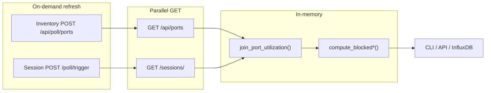

# IxPort Utilization Plotter

Identifies **blocked** Ixia chassis ports — owned and reserved but not carrying traffic. Polls Inventory Explorer + Session Explorer, joins data in memory, applies blocked-detection rules.

**New here?** → [QUICKSTART.md](QUICKSTART.md)

---

## Setup

```bash
python3 -m venv .venv
source .venv/bin/activate
pip install -r requirements.txt
cp .env.example .env   # edit URLs and tokens
```

**`.env` keys:**

| Variable | Purpose |
|----------|---------|
| `INVENTORY_EXPLORER_URL` | Inventory Explorer base URL |
| `SESSION_EXPLORER_URL` | Session Explorer base URL |
| `REFRESH_SETTLE_SECONDS` | Settle delay after poll trigger (default `3`) |
| `INVENTORY_POLL_TIMEOUT` / `SESSION_POLL_TIMEOUT` | POST poll timeout (seconds) |
| `INFLUXDB_*` | Only needed for `poll_port_metrics.py` |

---

## Run as CLI script

```bash
# Full report
.venv/bin/python scripts/sync_true_port_utilization.py

# Blocked ports only
.venv/bin/python scripts/sync_true_port_utilization.py --blocked-only

# All owned ports (triage)
.venv/bin/python scripts/sync_true_port_utilization.py --all

# One chassis, skip refresh (fast/cached)
.venv/bin/python scripts/sync_true_port_utilization.py --chassis 10.36.236.121 --no-refresh

# Session Explorer filters
.venv/bin/python scripts/sync_true_port_utilization.py --server ixnetworkweb --tag lab
```

Output columns: `chassis | port | owner | session | transmitState | cp | dp | utilization | blocked`

**HTML dashboard** (auto-refreshes every 5 min):

```bash
.venv/bin/python scripts/port_watch_dashboard.py
# http://<host>:8765
```

**InfluxDB metrics poller** (optional):

```bash
docker compose up -d   # start InfluxDB
.venv/bin/python scripts/poll_port_metrics.py --once     # single poll
.venv/bin/python scripts/poll_port_metrics.py            # every 5 min
.venv/bin/python scripts/poll_port_metrics.py --dry-run  # no write
```

---

## Run as API backend

```bash
./start.sh   # creates venv, installs deps, starts on 0.0.0.0:8890
```

Or manually:

```bash
uvicorn api.main:app --host 0.0.0.0 --port 8890 --reload
```

**Endpoints:**

| Method | Path | Description |
|--------|------|-------------|
| `GET` | `/api/v1/ports/owned` | All owned ports with per-port `blocked` flag |
| `GET` | `/api/v1/ports/blocked` | Blocked ports + `owner_summary` (who/how many) |

**Query params** (both endpoints): `chassis`, `server`, `tag`, `refresh` (default `false`)

```bash
curl http://localhost:8890/api/v1/ports/owned
curl "http://localhost:8890/api/v1/ports/blocked?refresh=true"
curl "http://localhost:8890/api/v1/ports/owned?chassis=10.36.236.121"
```

Swagger UI → `http://localhost:8890/docs`

---

## Blocked port rules

Full rubric: [docs/blocked_port_rubric.md](docs/blocked_port_rubric.md)

Only **owned** ports are evaluated (`owner` non-empty and not `Free`). `blocked` derives from `owner + transmitState + cp`.

**Port in an IxNetwork session:**

| transmitState | CP | blocked | Meaning |
|---|---|---|---|
| `0` | `False` | **True** | Reserved, no CP traffic — blocked |
| `0` | `True` | False | Control plane active |
| `1` | (any) | False | Chassis transmit active |

**Port owned but not in any session:**

| transmitState | blocked | Meaning |
|---|---|---|
| `1` | False | Windows/RDP client with active transmit |
| `0` | N/A | Cannot determine without session CP |

---

## How it works



Join key: `(chassis_ip, port)`. LEFT JOIN — every inventory port kept; session flags attach when matched.

---

## Project layout

```
api/
  main.py                         # FastAPI app — /api/v1/ports/owned + /blocked
  models.py                       # Pydantic response models
collector/
  ports_client.py                 # Inventory Explorer client
  session_ports_client.py         # Session Explorer client
  true_port_utilization.py        # fetch, join, format
  port_blocked.py                 # blocked rules
  join_keys.py
  influx_writer.py
scripts/
  sync_true_port_utilization.py   # main CLI
  port_watch_dashboard.py         # HTML blocked/owned watch
  poll_port_metrics.py            # optional Influx poller
  list_session_ports.py           # session-only debug
docs/
  blocked_port_rubric.md
  metrics.md
  IxiaInventoryExplorer_openapi.json
  IxNetworkSessionExplorer_openapi.json
tests/
```
