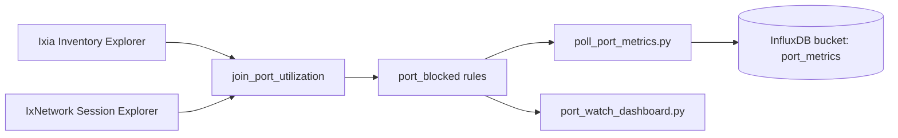

# Port utilization metrics

Reference for lab administrators: what we measure, how snapshots are written to InfluxDB (optional), and how the HTML port watch dashboard surfaces live state.

**Primary UI:** `scripts/port_watch_dashboard.py` → `web/port_watch.html` (blocked + all owned, 5m refresh).

---

## Data pipeline overview



1. **Inventory Explorer** — chassis, port, owner, `transmitState`.
2. **Session Explorer** — per-session ports with CP, DP, utilization.
3. **Join** — left join on `(chassis_ip, port)` → `TruePortUtilRecord`.
4. **Blocked rules** — `compute_blocked()` / `compute_blocked_without_session()`.
5. **Port watch** — `scripts/port_watch_dashboard.py` serves live tables (CLI-equivalent).
6. **Poll (optional)** — `scripts/poll_port_metrics.py` (default every **300s**) writes **one point per inventory port** per cycle to InfluxDB for history/Flux analysis.

---

## InfluxDB schema

| Item | Value |
|------|--------|
| **API** | InfluxDB 2.x |
| **Org** | `ixport` (default, env `INFLUXDB_ORG`) |
| **Bucket** | `port_metrics` (default, env `INFLUXDB_BUCKET`) |
| **Measurement** | `port_utilization` |
| **Timestamp** | UTC, nanosecond precision (poll time) |
| **Cardinality** | One series per `(chassis_id, port_id)` per poll; all ports written each cycle |

### Tags (indexed — use in `filter` / `group`)

| Tag | When set | Example |
|-----|----------|---------|
| `chassis_id` | Always | `10.36.236.121` |
| `port_id` | Always | `6.3` |
| `owner` | Owned port only (non-Free, non-empty) | `IxNetwork/admin` |

Free ports do **not** get an `owner` tag (reduces cardinality noise).

### Field encoding

Boolean and tri-state values are stored as **integers**:

| Stored value | Meaning |
|--------------|---------|
| `1` | True / yes / active |
| `0` | False / no / inactive |
| `-1` | N/A (unknown — typically no IxNetwork session row) |

---

## Metrics catalog

### Core port state

| Metric name (field) | Explanation | How we push data | Example (line protocol fragment) |
|---------------------|-------------|------------------|----------------------------------|
| **`blocked`** | Primary hogging signal. Owned port reserved but not carrying control-plane traffic (see rules below). `1` = blocked, `0` = not blocked, `-1` = unknown (owned, not in any session, `transmitState` not `1`). | Derived in `join_port_utilization()` via `collector/port_blocked.py`, then `record_to_point()` in `collector/influx_writer.py`. Written on every poll for every port. | Owned, in session, idle: `blocked=1i`. Utilized: `blocked=0i`. Owned, no session: `blocked=-1i`. |
| **`is_hogging`** | Legacy alias of **`blocked`** (same integer). | Same as `blocked`. | `is_hogging=1i` when `blocked=1i`. |
| **`is_owned`** | Port has a non-empty owner that is not `Free` (case-insensitive). | `int(is_port_owned(record.owner))`. | `is_owned=1i` for `IxNetwork/admin`; `0i` for `Free`. |
| **`cp`** | Control plane active (Session Explorer). | Session row present → `int(cp)`; else `-1`. | In session, CP on: `cp=1i`. No session: `cp=-1i`. |
| **`dp`** | Data plane active (Session Explorer). | Same pattern as `cp`. | `dp=0i` / `dp=1i` / `dp=-1i`. |
| **`utilization`** | Session “utilized” flag from Explorer. | Same pattern as `cp`. | `utilization=1i` when traffic/util flag set. |
| **`is_utilized`** | Legacy alias of **`utilization`**. | Same as `utilization`. | `is_utilized=1i`. |
| **`control_plane_active`** | Legacy alias of **`cp`**. | Same as `cp`. | `control_plane_active=1i`. |
| **`data_plane_active`** | Legacy alias of **`dp`**. | Same as `dp`. | `data_plane_active=0i`. |
| **`session_assigned`** | Port appears on at least one IxNetwork session (`cp` is not `None`). | `int(record.in_session)`. | `session_assigned=1i` in session; `0i` if only on chassis inventory. |
| **`transmit_idle`** | Chassis `transmitState == "0"`. | `int(record.transmit_state == "0")`. | `transmit_idle=1i` when transmit idle. |

### Session context (string fields)

| Metric name (field) | Explanation | How we push data | Example |
|---------------------|-------------|------------------|---------|
| **`owner_name`** | Owner string for tables (including empty for Free). | Always written as field. | `owner_name="IxNetwork/admin"` or `owner_name=""`. |
| **`ixnet_server`** | IxNetwork server hostname when in session. | From `SessionPortRecord` when joined. | `ixnet_server="ixnetworkweb"`. |
| **`session_name`** | Session name when in session. | From session row. | `session_name="admin-3-3251376"`. |
| **`session_id`** | Session id when in session. | From session row. | `session_id="1"`. |
| **`session_label`** | Human-readable `server/session` or `N/A`. | `record.session_display`. | `session_label="ixnetworkweb/admin-3-3251376"` or `session_label="N/A"`. |

### Derived KPIs (computed in Flux or the HTML dashboard, not separate fields)

These use the fields above at the **latest snapshot** or over a **time range**.

| Metric name (concept) | Formula (latest snapshot) |
|-----------------------|---------------------------|
| **Total ports** | `count()` of distinct `(chassis_id, port_id)` at `last()` |
| **Free ports** | `is_owned == 0` |
| **Owned ports** | `is_owned == 1` |
| **Utilized ports** | `utilization == 1` (or `is_utilized == 1`) |
| **Blocked ports** | `blocked == 1` |
| **Unknown owned** | `is_owned == 1` and `blocked == -1` |
| **Scarcity index** | `blocked / (blocked + free)` (when denominator > 0) |
| **Utilization efficiency** | `utilized / owned` |
| **Blocked port-hours** | Time integral where `blocked == 1` over 7d/30d |
| **Blocked % by owner** | `blocked_count / owned_count` per `owner` tag |

---

## Blocked rules (source of `blocked` / `is_hogging`)

Evaluation applies only to **owned** ports (`owner` not empty and not `Free`).

### Port in an IxNetwork session

| transmitState | CP | blocked | Meaning |
|---------------|-----|---------|---------|
| `0` | `False` | **1** | Reserved, no control-plane traffic (**blocked**) |
| `0` | `True` | **0** | Control plane active |
| `1` | (any) | **0** | Chassis transmit active |

### Port owned but not in any session

| transmitState | blocked | Meaning |
|---------------|---------|---------|
| `1` | **0** | e.g. Windows/RDP — not treated as hogging |
| `0` or other | **-1** (unknown) | Cannot classify without session CP |

### Free / unowned (empty or `Free` owner)

| blocked | cp / dp / utilization |
|---------|------------------------|
| **0** (available, not hogging) | N/A when not in session; as reported when in session |

Implementation: `collector/port_blocked.py`.

---

## How we push data (collector → InfluxDB)

### 1. Environment

```bash
# .env (see .env.example)
INVENTORY_EXPLORER_URL=http://...
SESSION_EXPLORER_URL=http://...
INFLUXDB_URL=http://localhost:8086
INFLUXDB_TOKEN=<token>
INFLUXDB_ORG=ixport
INFLUXDB_BUCKET=port_metrics
REFRESH_SETTLE_SECONDS=3
```

### 2. Run the poller

```bash
# Single snapshot
.venv/bin/python scripts/poll_port_metrics.py --once

# Every 5 minutes (default)
.venv/bin/python scripts/poll_port_metrics.py

# Fetch only — no write
.venv/bin/python scripts/poll_port_metrics.py --once --dry-run
```

Each cycle:

1. POST refresh to Inventory (`/api/poll/ports`) and Session Explorer (`/poll/trigger`) unless disabled.
2. Wait `REFRESH_SETTLE_SECONDS` (default 3s).
3. GET inventory + session ports, join, apply blocked rules.
4. `write_port_snapshots(records)` → one `port_utilization` point per port.

### 3. Example: Python record → Influx point

```python
from collector.influx_writer import record_to_point
from collector.true_port_utilization import TruePortUtilRecord

record = TruePortUtilRecord(
    chassis="10.36.236.121",
    port="6.3",
    owner="IxNetwork/admin",
    transmit_state="0",
    cp=False,
    dp=False,
    utilization=False,
    blocked=True,
    ixnet_server="ixnetworkweb",
    session_name="admin-3-3251376",
    session_id="1",
)
point = record_to_point(record)
# Line protocol (illustrative):
# port_utilization,chassis_id=10.36.236.121,port_id=6.3,owner=IxNetwork/admin
#   blocked=1i,cp=0i,dp=0i,utilization=0i,is_owned=1i,session_assigned=1i,
#   is_hogging=1i,session_label="ixnetworkweb/admin-3-3251376",...
```

### 4. Example: owned port not in session (unknown)

```python
record = TruePortUtilRecord(
    chassis="10.36.236.121",
    port="3.1",
    owner="IxNetwork/admin",
    transmit_state="0",
    cp=None,
    dp=None,
    utilization=None,
    blocked=None,
)
# → blocked=-1i, cp=-1i, dp=-1i, utilization=-1i, session_assigned=0i
```

### 5. Docker stack (InfluxDB only)

```bash
docker compose up -d
# Influx: http://localhost:8086
```

Point the poller at the same org/bucket/token as `docker-compose.yml` / `.env`.

---

## InfluxDB queries (Flux)

**Bucket:** `port_metrics` · **Org:** `ixport` · **Measurement:** `port_utilization`

### Common Flux patterns

**Latest snapshot per port** (stats, tables, “now” panels):

```flux
from(bucket: "port_metrics")
  |> range(start: -15m)
  |> filter(fn: (r) => r._measurement == "port_utilization")
  |> filter(fn: (r) => r._field == "blocked" or r._field == "is_owned" or r._field == "utilization")
  |> last()
```

**Count blocked ports now:**

```flux
from(bucket: "port_metrics")
  |> range(start: v.timeRangeStart, stop: v.timeRangeStop)
  |> filter(fn: (r) => r._measurement == "port_utilization" and r._field == "blocked")
  |> last()
  |> filter(fn: (r) => r._value == 1)
  |> count()
```

**Blocked ports table (Ops):**

```flux
from(bucket: "port_metrics")
  |> range(start: -15m)
  |> filter(fn: (r) => r._measurement == "port_utilization")
  |> filter(fn: (r) => r._field == "blocked" or r._field == "session_label" or r._field == "owner_name")
  |> last()
  |> filter(fn: (r) => r._field == "blocked")
  |> filter(fn: (r) => r._value == 1)
```

**Blocked by owner (Ops / Capacity):**

```flux
from(bucket: "port_metrics")
  |> range(start: v.timeRangeStart, stop: v.timeRangeStop)
  |> filter(fn: (r) => r._measurement == "port_utilization" and r._field == "blocked")
  |> filter(fn: (r) => r._value == 1)
  |> group(columns: ["owner"])
  |> count()
```

**Lab-wide blocked trend (both dashboards):**

```flux
from(bucket: "port_metrics")
  |> range(start: v.timeRangeStart, stop: v.timeRangeStop)
  |> filter(fn: (r) => r._measurement == "port_utilization" and r._field == "blocked")
  |> filter(fn: (r) => r._value == 1)
  |> aggregateWindow(every: v.windowPeriod, fn: count, createEmpty: false)
```

**Per-port blocked history:**

```flux
from(bucket: "port_metrics")
  |> range(start: v.timeRangeStart, stop: v.timeRangeStop)
  |> filter(fn: (r) => r._measurement == "port_utilization")
  |> filter(fn: (r) => r.chassis_id == "${chassis_id}" and r.port_id == "${port_id}")
  |> filter(fn: (r) => r._field == "blocked")
  |> aggregateWindow(every: v.windowPeriod, fn: last, createEmpty: false)
```

Variables: `chassis_id`, `port_id` from `schema.tagValues` on bucket `port_metrics`.

Poller interval (default **300s**) sets the resolution for duration and trend calculations; do not expect sub-minute precision unless poll interval is lowered.

---

## Tools

| Tool | Output | Use when |
|------|--------|----------|
| `scripts/sync_true_port_utilization.py` | Terminal tables (blocked / all owned) | Ad-hoc triage |
| `scripts/port_watch_dashboard.py` | HTML dashboard (5m refresh) | Keep a browser tab on blocked ports |
| `scripts/poll_port_metrics.py` | Influx points + optional blocked owner report | Optional time-series history |

Display labels in CLI/HTML: `True` / `False` / `N/A`. Influx: `1` / `0` / `-1`.

---

## Code references

| Component | Path |
|-----------|------|
| Join + `TruePortUtilRecord` | `collector/true_port_utilization.py` |
| Blocked rules | `collector/port_blocked.py` |
| Influx mapping | `collector/influx_writer.py` |
| Integer encodings | `influx_metric_value()`, `influx_blocked_value()` in `collector/true_port_utilization.py` |
| Poller entrypoint | `scripts/poll_port_metrics.py` |
| HTML dashboard | `scripts/port_watch_dashboard.py`, `web/port_watch.html` |
| Point tests | `tests/test_influx_writer.py` |
